# 🚀 Comprehensive WordPress on AWS: Technical Showcase

This project demonstrates a production-grade, highly available WordPress deployment on AWS using Kubernetes. Below is a detailed visual guide through the infrastructure, storage, and networking layers.

---

## 🏗️ Project Architecture Overview
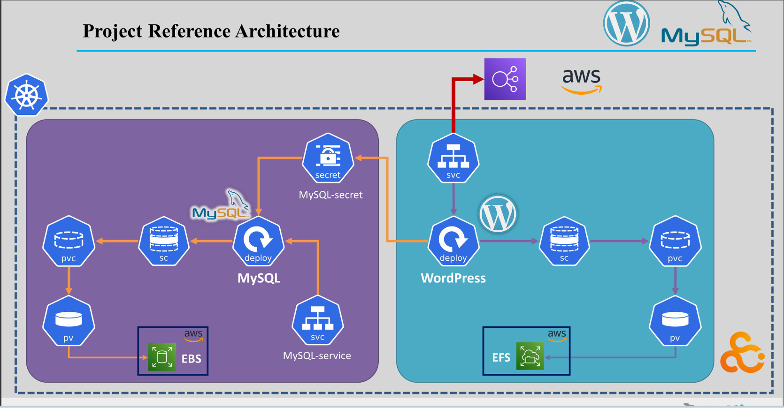
The master blueprint illustrating the high-availability flow between the AWS Load Balancer, Kubernetes ecosystem, and the hybrid storage layer (EFS & EBS).

---

## 📸 Technical Documentation & Visuals

### 1. project-architecture

The master blueprint. It illustrates the hybrid storage model (EFS + EBS) and how Kubernetes orchestrates the frontend/backend communication within the AWS cloud perimeter.

### 2. project-ALP (Application Load Balancer)
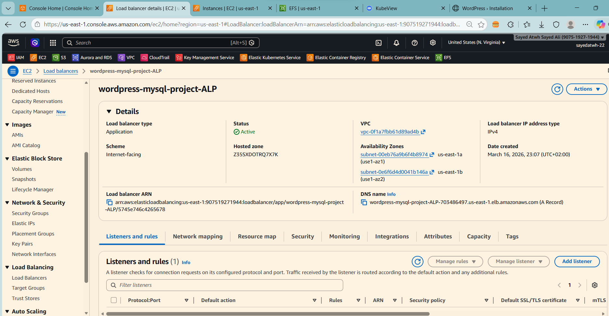
The entry point for all traffic. The Application Load Balancer (ALB) provides a single DNS entry and handles SSL termination, ensuring secure and efficient traffic distribution.

### 3. project-Target-Group
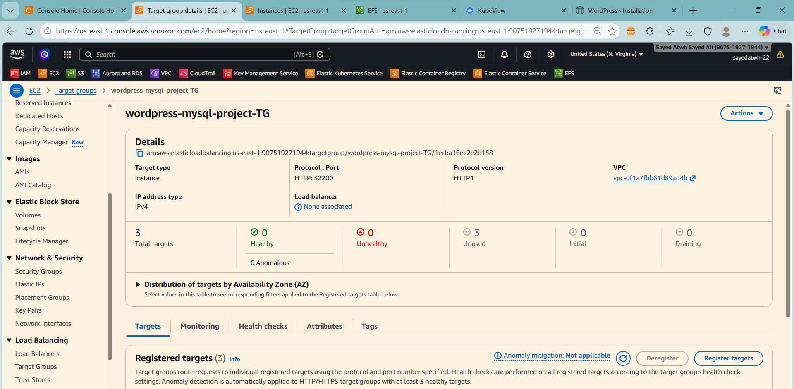
The Target Group acts as the bridge between the ALB and the Kubernetes nodes. It performs health checks to ensure traffic is only routed to healthy ec2 instances.

### 4. clusterNode-node-ec2
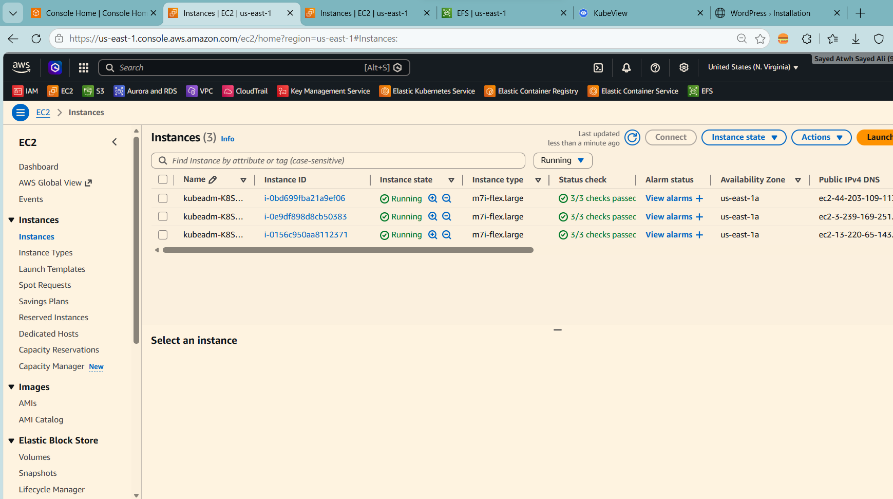
The "muscle" of the project. These Amazon EC2 instances form the Kubernetes cluster nodes where our WordPress and MySQL pods reside.

### 5. create-awsEFS
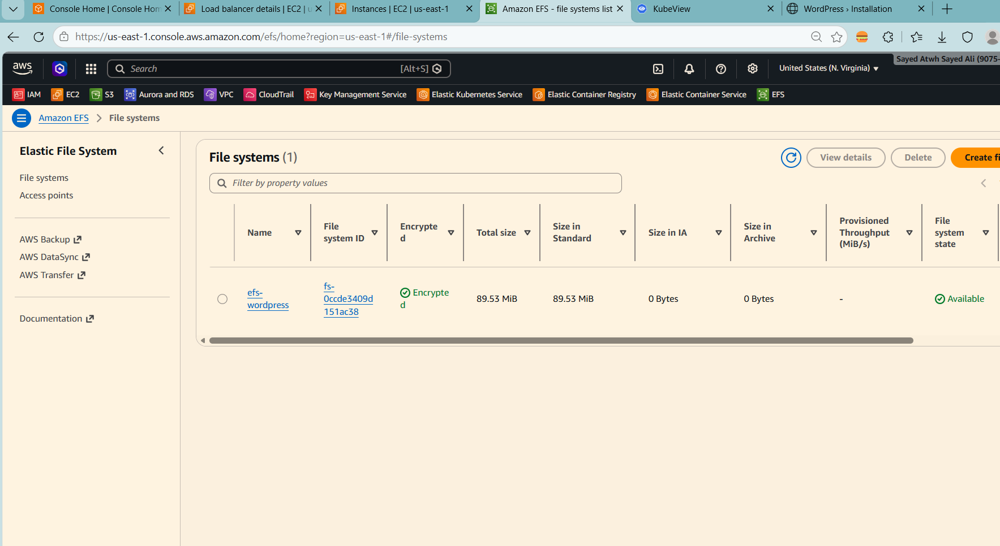
Creating the Amazon EFS filesystem. EFS provides the shared network storage required for WordPress to scale horizontally, allowing all pods to access the same `wp-content`.

### 6. create-accessPoint-EFS
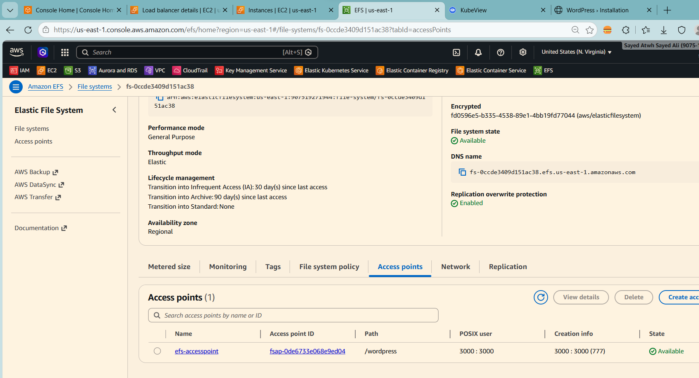
EFS Access Points are application-specific entry points into an EFS file system. They simplify managing application access by enforcing a user identity and root directory.

### 7. aws-EBS
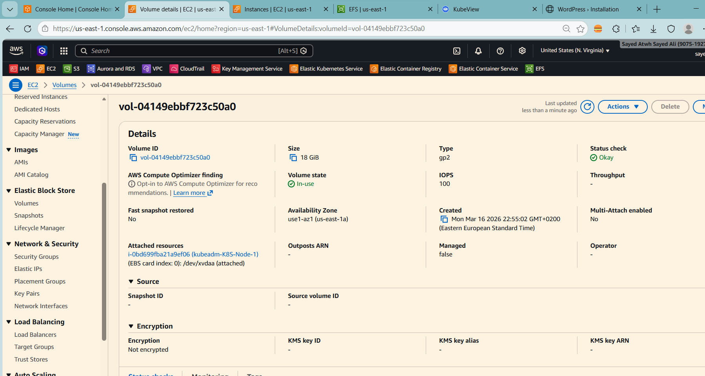
The high-performance block storage for our database. Amazon EBS ensures that the MySQL data is persistent and has the high IOPS required for database operations.

### 8. kubeview
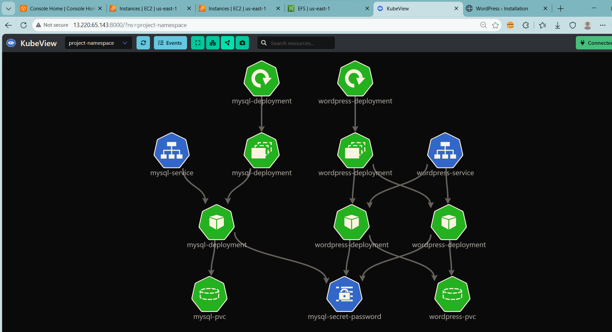
A real-time visual representation of the Kubernetes cluster. It shows the logical relationship between services, deployments, and pods across the physical nodes.

### 9. resources-all
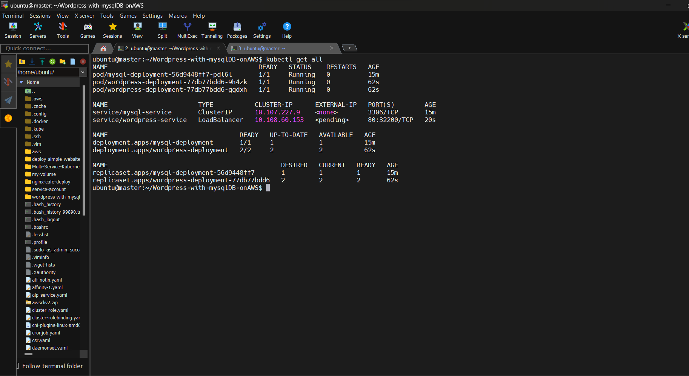
Zero "Noisy Neighbor" policy. By defining CPU and Memory `requests` and `limits`, we ensure every container has the resources it needs without crashing others.

### 10. yaml-file-from-project
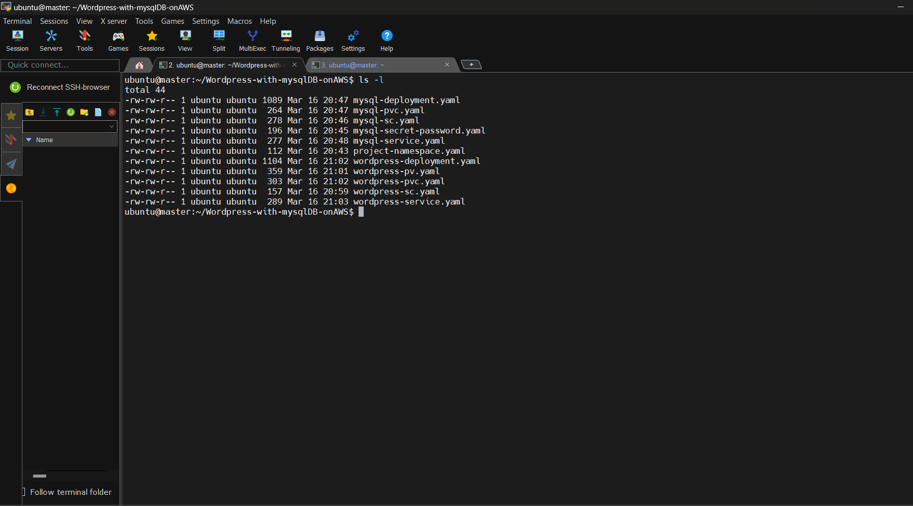
Infrastructure as Code (IaC). Every component in this project is defined via declarative YAML manifests, ensuring the entire setup is reproducible and version-controlled.

### 11. wordPress-website
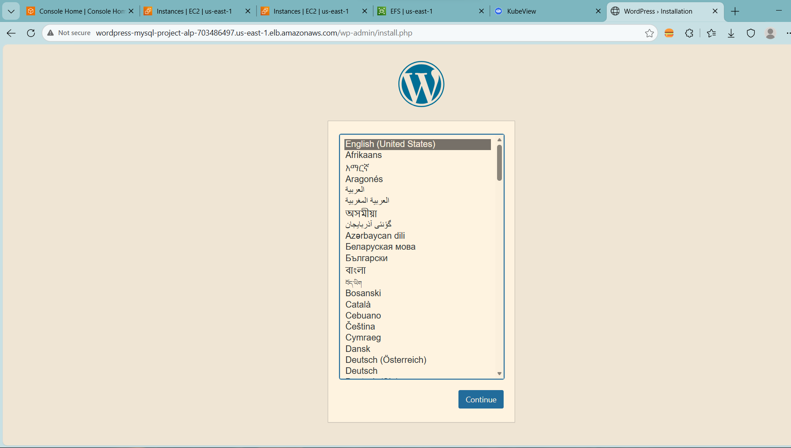
The final result: A fully operational, responsive, and high-performance WordPress site running on a robust, enterprise-grade cloud architecture.

---

## ☸️ Step-by-Step Deployment

> [!TIP]
> Always deploy the **Namespace** and **Secrets** first to provide the foundation for the rest of the stack.

1. **Foundations**: `kubectl apply -f project-namespace.yaml` & `mysql-secret-password.yaml`
2. **Storage**: `kubectl apply -f mysql-sc.yaml`, `wordpress-pv.yaml`, & `wordpress-pvc.yaml`
3. **Database**: `kubectl apply -f mysql-deployment.yaml`
4. **App**: `kubectl apply -f wordpress-deployment.yaml` & `wordpress-service.yaml`

👤 Author

Name : Sayed Atwh Sayed

GitHub : https://github.com/SayedAtwh/

LinkedIn : https://www.linkedin.com/in/sayed-atwh-sayed

Email : sayed.atwh.sayed@gmail.com
---