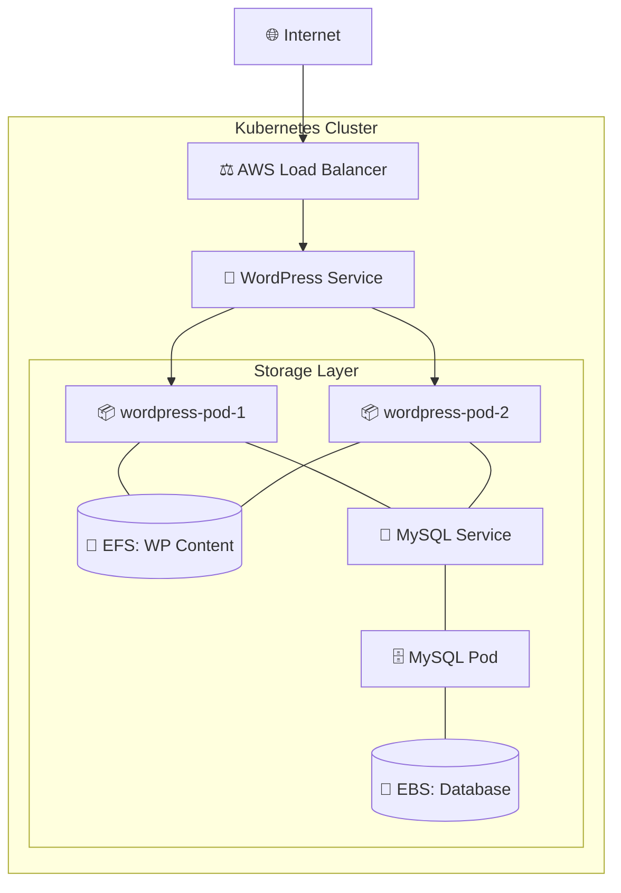

# 🚀 WordPress & MySQL High-Availability Deployment on AWS

A production-grade Kubernetes deployment featuring shared persistent storage via Amazon EFS, high-performance database blocks with Amazon EBS, and robust traffic management.

---

## 🏗️ Architecture Visualization
Understanding the flow between components is crucial for a stable deployment.



---

## 📸 Component deep dive

### 1. Storage Hybrid Strategy
We separate static content from database data to maximize throughput and reliability.

| Component | Storage Type | Purpose |
| :--- | :--- | :--- |
| **WordPress Files** | **Amazon EFS** | Allows multiple pods to read/write the same media & plugins simultaneously. |
| **MySQL Data** | **Amazon EBS** | Guaranteed low-latency block storage for lightning-fast database queries. |


> [!NOTE]
> **EFS Setup**: We use EFS for `/var/www/html` to ensure that when you upload an image to one WordPress pod, it is instantly available to all other pods.

### 2. Traffic Management

> [!TIP]
> **Kubeview Visualization**: This view shows how Kubernetes balances our frontend pods across different nodes, ensuring that if one node fails, the site stays online.

---

## 🚨 Stability: Resolving "Noisy Neighbor" Issues
A common issue in Kubernetes is when one container steals all the CPU/RAM, crashing others. We solve this using **Resources**.


> [!IMPORTANT]
> **Crucial Best Practice**: Every container should have `requests` and `limits`. 
> - **Requests**: Guaranteed minimum resources.
> - **Limits**: The hard ceiling to prevent a container from impacting "neighbors".

---

## ☸️ Quick Start Guide

### 1️⃣ Initial Infrastructure
```bash
# Create the project workspace
kubectl apply -f project-namespace.yaml

# Secure your database credentials
kubectl apply -f mysql-secret-password.yaml
```

### 2️⃣ Provision Storage
```bash
# Set up StorageClasses and Volumes
kubectl apply -f mysql-sc.yaml
kubectl apply -f wordpress-pv.yaml
kubectl apply -f wordpress-pvc.yaml
```

### 3️⃣ Launch Core Services
```bash
# Deploy Database first
kubectl apply -f mysql-deployment.yaml

# Deploy WordPress Frontend
kubectl apply -f wordpress-deployment.yaml

# Expose to the internet
kubectl apply -f wordpress-service.yaml
```

---

## 🌟 The Final Result
Once deployed, your high-availability WordPress site is fully operational on AWS.


---
*Developed with a focus on Cloud-Native Reliability & DevOps Excellence.*